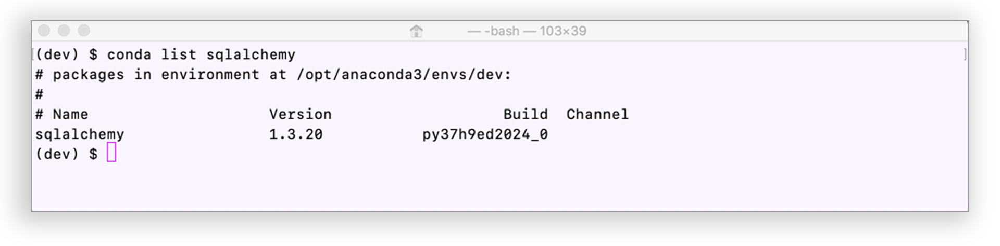
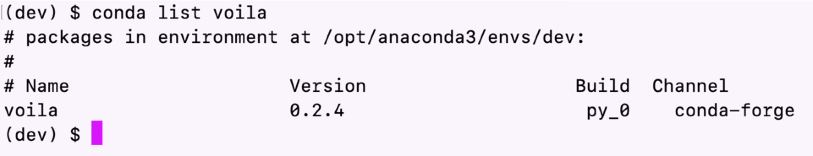

# 7
---
## Tools

* SQLAlchemy - This is an open-source SQL library to help ease the communication between Python-based programs and databases.
* Voilà - This will allow you to convert your Jupyter notebook into a live webpage.

---
## Installations

In terminal, with your conda `dev` environment active, run:

* Install SQLAlchemy

```python
pip install SQLAlchemy
```

To confirm your installation,
```python
conda list sqlalchemy
```
It should appear with version number:


* Install Voilà

In terminal, with your conda `dev`  environment active, run:

```python
conda install -c conda-forge voila
```

To confirm your installation,
``` python
conda list voila
```
It should appear with version number:
