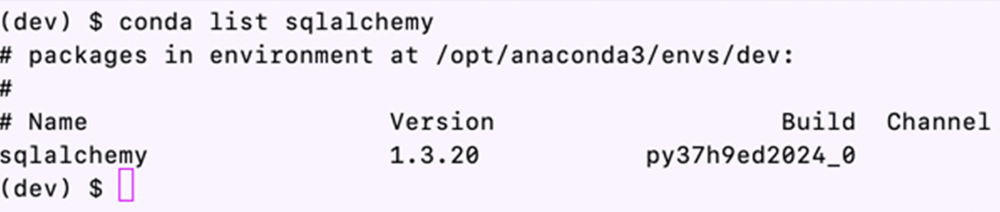

# ETF Investment Analyzer


This is a financial database and web application using SQL, Python and Voilà to analyze an exchange-traded fund (ETF) performance.

---
## Tools

* [SQLAlchemy](https://www.sqlalchemy.org/) - This is an open-source SQL library to help ease the communication between Python-based programs and databases.
* Voilà - This will allow you to convert your Jupyter notebook into a live webpage.

---
## Installations

In terminal, with your conda `dev` environment active, run:

* Install SQLAlchemy

```python
pip install SQLAlchemy
```

To confirm your installation,
```python
conda list sqlalchemy
```
It should appear with version number:


* Install Voilà

In terminal, with your conda `dev`  environment active, run:

```python
conda install -c conda-forge voila
```

To confirm your installation,
``` python
conda list voila
```
It should appear with version number:


---
Using Voilà to deploy Web Application
[]({https://www.dropbox.com/s/a6ly4mw3bdd37g3/2021-11-07_14-53-58.mp4?dl=0} "Please the 'Play' button to see Voilà in action")

---
## Contributors
Christina San Diego [LinkedIn](https://www.linkedin.com/in/christinabuted)